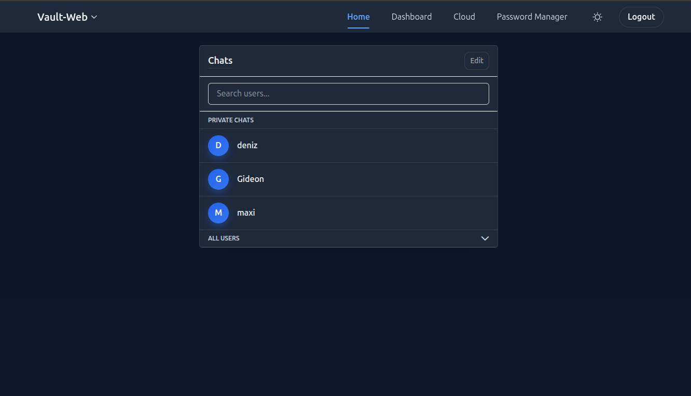
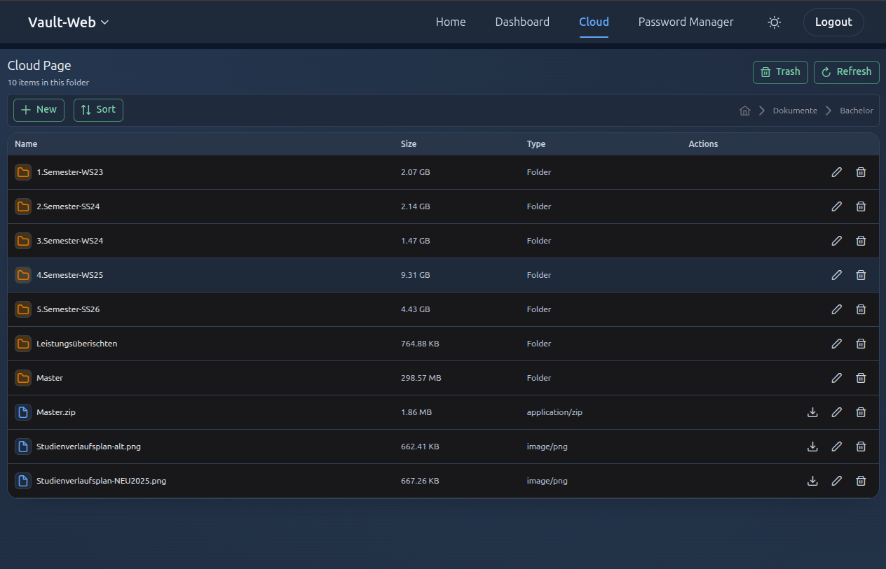

# Vault Web

Vault Web is a modular, self-hosted portal for private services on a home server. It provides one web interface for account management, communication, files, and independently deployed applications.

The project combines a central Angular frontend with a core Spring Boot application and service-specific backends connected through APIs. It is built for practical self-hosting, architecture experiments, and security-focused learning.

## Architecture

Vault Web follows a service-oriented architecture with a centralized user interface:

- The Angular frontend is maintained in the core `vault-web` repository.
- The core backend owns users, sessions, authentication, chat, and shared application concerns.
- Domain services expose independent APIs and own their application logic.
- Runtime integration happens through authenticated HTTP APIs and configurable frontend links.
- The deployment stack is managed with Docker Compose.
- Remote access is designed around Headscale/Tailscale, HTTPS termination, and private Split DNS.

```text
Browser or mobile client
          |
          v
  Vault Web frontend
          |
          +--------> Vault Web core API
          +--------> Cloud Page API
          +--------> Additional service APIs
```

The long-term authentication direction is a dedicated gateway that centralizes token validation and authorization policies across services.

## Repositories

| Repository | Purpose | Status |
| --- | --- | --- |
| [vault-web](https://github.com/Vault-Web/vault-web) | Central Angular frontend and Spring Boot core for users, sessions, chat, and service integration | Active |
| [cloud-page](https://github.com/Vault-Web/cloud-page) | File and folder management API with per-user storage isolation | Active |
| [vault-habits](https://github.com/Vault-Web/vault-habits) | Self-hosted habit tracking with Vault Web authentication handoff | Active |
| [auth-api-gateway](https://github.com/Vault-Web/auth-api-gateway) | Central authentication and authorization gateway | In development |
| [password-manager](https://github.com/Vault-Web/password-manager) | Dedicated password-management service with an encryption-focused design | Research and planning |
| [deploy](https://github.com/Vault-Web/deploy) | Docker Compose deployment stack and service submodules | Active |
| [server-docs](https://github.com/Vault-Web/server-docs) | Deployment, Headscale, Syncthing, backup, and operations documentation | Active |

## Current Capabilities

- Central login and JWT-based access
- Private and group chat with per-device end-to-end encryption support
- File and folder management through Cloud Page
- Password-vault functionality in the core application while the standalone service is being designed
- Runtime integration of external services
- Habit tracking through Vault Habits
- VPN-only deployment using Headscale/Tailscale and Split DNS
- Docker Compose deployment, backup, and operational documentation

## Interface

### Chat

The core application provides the shared navigation and communication interface.



### Cloud Page

Cloud Page is exposed through the central frontend while its file-management backend remains a separate service.



## Deployment Model

The documented deployment keeps Vault Web private by default:

1. Application containers communicate on internal Docker networks.
2. Caddy terminates HTTPS and proxies requests to the frontend.
3. Headscale manages the private Tailscale-compatible network.
4. Split DNS resolves the Vault Web hostname only for connected clients.
5. Cloud Page, backups, and optional Syncthing instances operate as separate stack components.

Start with the [deployment repository](https://github.com/Vault-Web/deploy) for the runnable stack and [Server Docs](https://github.com/Vault-Web/server-docs) for the complete setup and operations guides.

## Contributing

Contributions are welcome across application development, service integration, deployment, documentation, and security design. Read the [contribution guidelines](https://github.com/Vault-Web/.github/blob/main/CONTRIBUTING.md) before opening a pull request.

Vault Web is an experimental self-hosting project. Review the configuration and security model carefully before exposing any component beyond a trusted private network.
