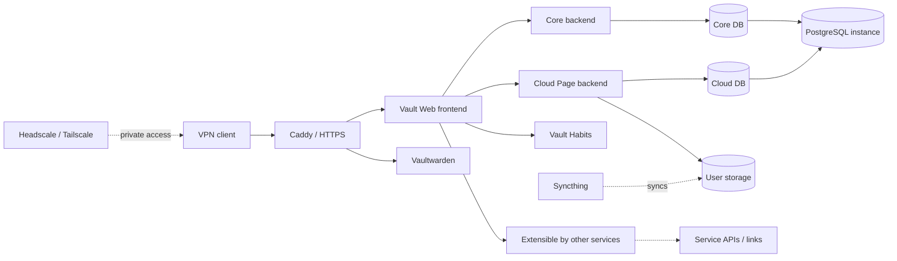
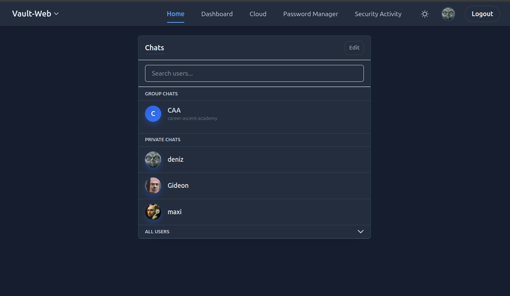
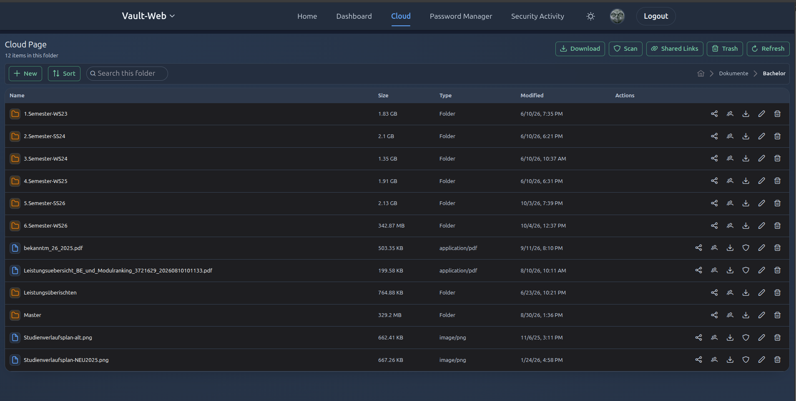

# Vault Web

**A private entry point for chat, files, habits, passwords, and self-hosted services.**

Vault Web is a modular, self-hosted portal for private home-server services. It provides a single web interface for **authentication**, communication, file management, habit tracking, and service integration while keeping each service independently deployable.

The project is designed as a lighter, more focused alternative to large all-in-one platforms: small services, clear boundaries, **VPN-first deployment**, and practical operations for a personal server.

## What This Organization Builds

Vault Web combines a central portal with domain-specific services. The core application owns users, sessions, chat, and the main navigation experience. Services such as Cloud Page, Vault Habits, and Vaultwarden stay separate and integrate through APIs or **authenticated frontend links**. New services can be added without folding all logic into the portal itself.

```mermaid
flowchart LR
    client[VPN client] --> proxy[Caddy / HTTPS]
    proxy --> frontend[Vault Web frontend]
    frontend --> core[Core backend]
    frontend --> cloud[Cloud Page backend]
    frontend --> habits[Vault Habits]
    proxy --> vaultwarden[Vaultwarden]
    frontend --> extensions[Extensible by other services]

    core --> coredb[(Core DB)]
    cloud --> clouddb[(Cloud DB)]
    coredb --> postgres[(PostgreSQL instance)]
    clouddb --> postgres
    cloud --> storage[(User storage)]
    syncthing[Syncthing] -. syncs .-> storage
    extensions -.-> apis[Service APIs / links]
    headscale[Headscale / Tailscale] -. private access .-> client
```

## Repositories

| Repository | Role |
| --- | --- |
| [`vault-web`](https://github.com/Vault-Web/vault-web) | Central portal frontend and core backend with **authentication**, sessions, chat, and navigation |
| [`cloud-page`](https://github.com/Vault-Web/cloud-page) | File-management backend with **per-user storage isolation** |
| [`vault-habits`](https://github.com/Vault-Web/vault-habits) | Self-hosted habit tracker integrated through Vault Web login |
| [`vaultwarden`](https://github.com/Vault-Web/vaultwarden) | Integrated upstream/forked **Bitwarden-compatible** password vault service |
| [`auth-api-gateway`](https://github.com/Vault-Web/auth-api-gateway) | Experimental authentication gateway, not required for the current production stack |
| [`deploy`](https://github.com/Vault-Web/deploy) | Production Docker Compose stack, runtime configuration, and **VPN-first deployment** |
| [`server-docs`](https://github.com/Vault-Web/server-docs) | **Headscale**, **Split DNS**, Syncthing, backup, and operations documentation |
| [`password-manager`](https://github.com/Vault-Web/password-manager) | Archived custom password-vault service, replaced by Vaultwarden integration |

## Focus Areas

| Area | Direction |
| --- | --- |
| Network design | **Least-exposed**, VPN-first access with Headscale/Tailscale and Split DNS |
| Service boundaries | Independent backends instead of one large application server |
| Personal cloud | Filesystem-backed storage with **per-user isolation** and Syncthing interoperability |
| Identity | **Consistent login**, session handling, and authenticated service handoff |
| Security | Security activity, token hardening, and a private-by-default deployment model |
| Operations | Docker Compose deployment, **backups**, health checks, and recovery-oriented runbooks |

## Interface

### Communication

### Cloud Workspace

## Deployment Model

The documented production setup keeps Vault Web **private by default**. Public DNS is reserved for the **VPN control plane**, while application hostnames resolve only inside the private network through **Split DNS**. Caddy terminates **HTTPS**, Docker Compose runs the services, and operational guidance lives in [`deploy`](https://github.com/Vault-Web/deploy) and [`server-docs`](https://github.com/Vault-Web/server-docs).

This model is intentionally conservative: **expose as little as possible**, keep the portal reachable through trusted private access, and treat **backups and monitoring** as part of the product rather than an afterthought.

## Contributing

Contributions are welcome across application development, security design, deployment, documentation, and service integration. Please read the [contribution guidelines](https://github.com/Vault-Web/.github/blob/main/CONTRIBUTING.md) before opening a pull request.

Vault Web is an experimental self-hosting project. Review the configuration and security model carefully before exposing any component outside a trusted private network.
